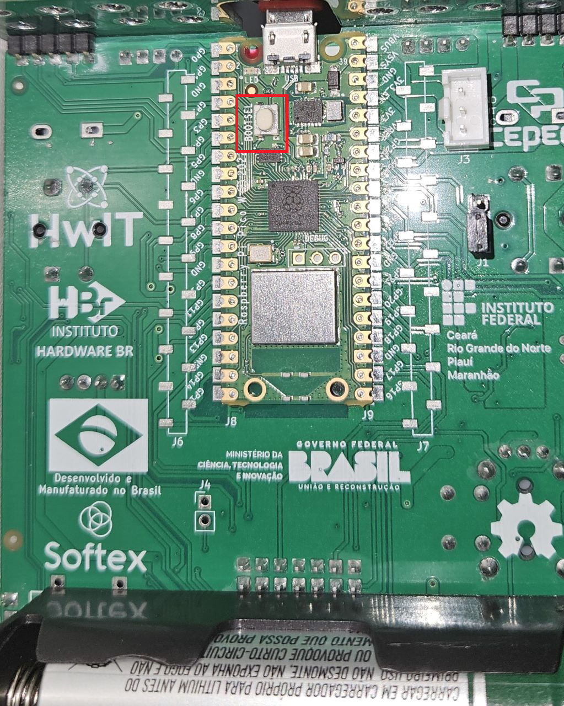
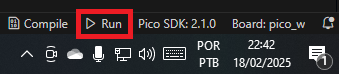

# Incubação de Ovos para Frangos de Corte

## Sumário

1. [💡 O que é este projeto](#1--o-que-é-este-projeto)
2. [🎥 Vídeo demonstrativo](#2--vídeo-demonstrativo)
3. [🔎 Funcionalidades disponíveis](#3--funcionalidades-disponíveis)
4. [🧰 Pré-requisitos para executar](#4--pré-requisitos-para-executar)
5. [💻 Como executar a simulação](#5--como-executar-a-simulação)
6. [👥 Colaboradores do projeto](#6--colaboradores-do-projeto)
7. [✨ Recursos para versionamento](#7--recursos-para-versionamento)

## 1. 💡 O que é este projeto

Este é um firmware escrito em C para controlar a temperatura de um ambiente destinado à incubação de ovos. A temperatura é simulada  — via ADC — pelo Joystick e a variação da temperatura é de acordo com "o ambiente em que o ovo se encontra" - Sala de Ovos, Pré-Incubadora, Incubadora - sendo estes alternados de acordo o acionamento de botões disponíveis na placa BitDogLab. Os botões ativam rotinas de interrupções que alteram temperatura máxima, mínima e ideal, exibindo no display o ambiente que está sendo simulado. O LED RGB tem suas cores alternadas conforme a temperatura ideal simulada sendo: `Azul` acionado caso temperatura esteja abaixo da ideal, `Verde` para temperatura ideal e `Vermelho` para temperatura acima. A variação da temperatura influencia na intensidade da iluminação da matriz de LEDs que simula a fonte de calor do projeto.

## 2. 🎥 Vídeo demonstrativo

Uma demonstração do projeto em funcionamento pode ser assistida no link abaixo:

[INSERIR LINK]

## 3. 🔎 Funcionalidades disponíveis

Por meio dos botões, o usuário pode realizar as seguintes ações:

- Pressionar `Botão A` simula as temperaturas máximas, mínimas e ideal na Pré-Incubação;
- Pressionar `Botão B` simula as temperaturas máximas, mínimas e ideal na Incubação;
- Pressionar `Botão Joystick` simula as temperaturas máximas, mínimas e ideal na Sala de Ovos;
- Altera o temperatura simulada com base na posição do joystick (eixo y);
- Altera a cor do LED RGB com base na temperatura simulada e temperatura ideal;
- Altera a intensidade do brilho da matriz de LEDs com base na temperatura simulada e temperatura ideal;

## 4. 🧰 Pré-requisitos para executar

A configuração sugerida para executar o projeto é:

1. Ter o [Pico SDK](https://github.com/raspberrypi/pico-sdk) instalado na sua máquina;
2. Ter o [ARM GNU Toolchain](https://developer.arm.com/Tools%20and%20Software/GNU%20Toolchain) instalado na sua máquina;
3. Ter o [Visual Studio Code](https://code.visualstudio.com/download) instalado na sua máquina;
4. Ter este repositório clonado na sua máquina;
5. Ter as seguintes extensões instaladas no seu VS Code:
- [C/C++](https://marketplace.visualstudio.com/items?itemName=ms-vscode.cpptools);
- [CMake](https://marketplace.visualstudio.com/items?itemName=twxs.cmake);
- [CMake Tools](https://marketplace.visualstudio.com/items?itemName=ms-vscode.cmake-tools);
- [Raspberry Pi Pico](https://marketplace.visualstudio.com/items?itemName=raspberry-pi.raspberry-pi-pico);
- [Wokwi Simulator](https://marketplace.visualstudio.com/items?itemName=Wokwi.wokwi-vscode).

## 5. 💻 Como executar a simulação

Com os pré-requisitos atendidos, siga os passos a seguir:

1. Utilize o VS Code para abrir a pasta raiz do projeto clonado:

2. Clique em "Compile", à direita da barra de status e aguarde o processo:

3. Conecte sua placa BitDogLab via USB apertando o botão bootsel:

4. Clique em "Run", à direita da barra de status e aguarde o processo:

## 6. 👥 Colaboradores do projeto

Autora do projeto:

### Desenvolvedora

#### Cibelle Sousa Rodrigues

## 7. ✨ Recursos para versionamento

### Conventional Commits

Conventional Commits seguem uma estrutura fixa como feat, fix, docs e style, o que facilita identificar o escopo das mudanças. Isso ajuda a organizar o histórico e facilita o versionamento (por exemplo, ao definir o número da próxima versão do software).

### Branches nomeadas segundo o escopo

A nomeação de branches como `feature/...`, `docs/...` ou `bugfix/...` organiza o fluxo de trabalho e indica o propósito da branch, facilitando o entendimento. Portanto, foi um recurso adotado durante o desenvolvimento do projeto.

### Diretivas de pré-processamento

Neste projeto, utilizamos diretivas de pré-processamento para definir os pinos e periféricos utilizados. O display OLED está configurado para comunicação via I2C, utilizando os pinos GPIO 14 e GPIO 15 para SDA e SCL, respectivamente. O joystick analógico tem seu eixo Y conectados aos pinos GPIO 27, que é utilizado como entrada analógicas para leitura do ADC.

Os LEDs estão associados aos GPIOs 11, 12 e 13, sendo controlados de acordo com as leituras do ADC para ajuste de cor. O projeto também conta com botões físicos, como o botão A conectado ao GPIO 5, botão B conectado ao GPIO 6,e o botão do próprio joystick que está no GPIO 22. Para garantir o uso da matriz de LEDs, utilizamos a GPIO 7.
